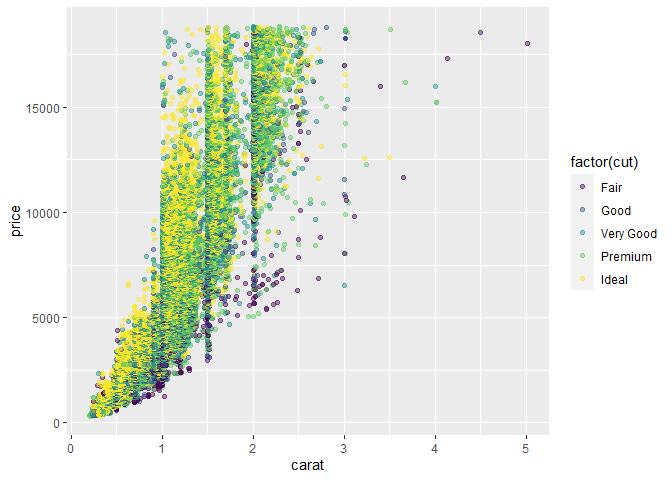
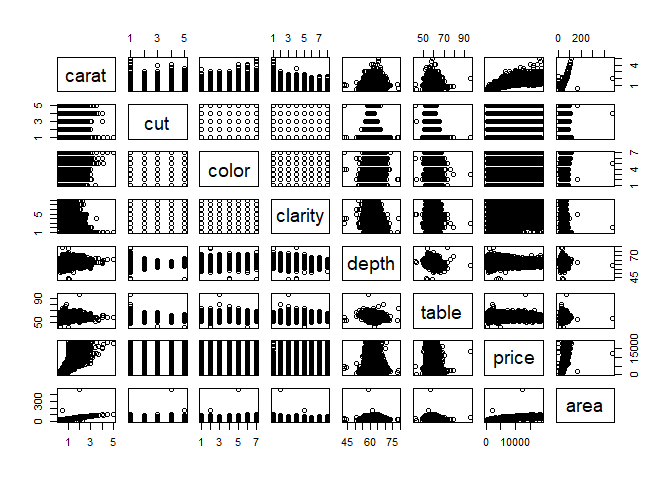
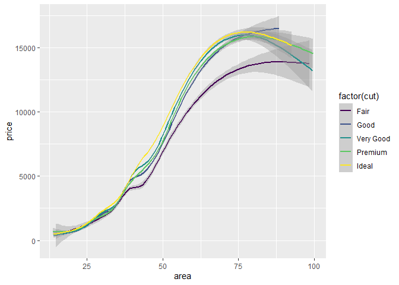

Getting Started: Diamonds
================
Mason del Rosario
2020-07-11

  - [Data Exploration](#data-exploration)
  - [Communication](#communication)

<!-- *Purpose*: Throughout this course, you'll complete a large number of *exercises* and *challenges*. Exercises are meant to introduce content with easy-to-solve problems, while challenges are meant to make you think more deeply about and apply the content. The challenges will start out highly-scaffolded, and become progressively open-ended. -->

<!-- In this challenge, you will go through the process of exploring, documenting, and sharing an analysis of a dataset. We will use these skills again and again in each challenge. -->

<!-- <!-- include-rubric -->

<!-- # Grading Rubric -->

<!-- <!-- -------------------------------------------------- -->

<!-- Unlike exercises, **challenges will be graded**. The following rubrics define how you will be graded, both on an individual and team basis. -->

<!-- ## Individual -->

<!-- <!-- ------------------------- -->

<!-- | Category | Unsatisfactory | Satisfactory | -->

<!-- |----------|----------------|--------------| -->

<!-- | Effort | Some task __q__'s left unattempted | All task __q__'s attempted | -->

<!-- | Observed | Did not document observations | Documented observations based on analysis | -->

<!-- | Supported | Some observations not supported by analysis | All observations supported by analysis (table, graph, etc.) | -->

<!-- | Code Styled | Violations of the [style guide](https://style.tidyverse.org/) hinder readability | Code sufficiently close to the [style guide](https://style.tidyverse.org/) | -->

<!-- ## Team -->

<!-- <!-- ------------------------- -->

<!-- | Category | Unsatisfactory | Satisfactory | -->

<!-- |----------|----------------|--------------| -->

<!-- | Documented | No team contributions to Wiki | Team contributed to Wiki | -->

<!-- | Referenced | No team references in Wiki | At least one reference in Wiki to member report(s) | -->

<!-- | Relevant | References unrelated to assertion, or difficult to find related analysis based on reference text | Reference text clearly points to relevant analysis | -->

<!-- ## Due Date -->

<!-- <!-- ------------------------- -->

<!-- All the deliverables stated in the rubrics above are due on the day of the class discussion of that exercise. See the [Syllabus](https://docs.google.com/document/d/1jJTh2DH8nVJd2eyMMoyNGroReo0BKcJrz1eONi3rPSc/edit?usp=sharing) for more information. -->

``` r
library(tidyverse)
```

    ## -- Attaching packages ---------------------------------- tidyverse 1.3.0 --

    ## v ggplot2 3.3.2     v purrr   0.3.4
    ## v tibble  3.0.1     v dplyr   1.0.0
    ## v tidyr   1.1.0     v stringr 1.4.0
    ## v readr   1.3.1     v forcats 0.5.0

    ## -- Conflicts ------------------------------------- tidyverse_conflicts() --
    ## x dplyr::filter() masks stats::filter()
    ## x dplyr::lag()    masks stats::lag()

# Data Exploration

<!-- -------------------------------------------------- -->

In this first stage, you will explore the `diamonds` dataset and
document your observations.

**q1** Create a plot of `price` vs `carat` of the `diamonds` dataset
below. Document your observations from the visual.

*Hint*: We learned how to do this in `e-vis00-basics`\!

``` r
## TASK: Plot `price` vs `carat` below
## Your code here!
diamonds %>%
  ggplot(aes(y = price, x = carat, group = 1)) +
  geom_point()
```

<!-- -->

**Observations**:

  - There seems to be a power law relationship between `price` and
    `carat`.
  - Despite begin a continuous variable, `carat` seems pseudo-discrete.

**q2** Create a visualization showing variables `carat`, `price`, and
`cut` simultaneously. Experiment with which variable you assign to which
aesthetic (`x`, `y`, etc.) to find an effective visual.

``` r
## TASK: Plot `price`, `carat`, and `cut` below
## Your code here!
diamonds %>%
  ggplot(aes(y = price, x = carat, colour = factor(cut))) +
  geom_point(alpha = 0.45)
```

<!-- -->

**Observations**:

  - `cut` does not seem to mediate price.
      - The only caveat – Some `fair` diamonds fall below the ‘power
        law’ curve.
  - We propose that buyers look for the size of a diamonds face – a
    person is willing to pay a premium for a diamond with a large face.

**EDA: Pair Plots**

As a surrogate for face size, we construct a variable, `area`, which is
the product of the `x` and `y` variables.

Assess relationships between variables after adding in `area`.

``` r
diamonds$area = diamonds$x * diamonds$y
select(diamonds, -c(x,y,z)) %>% pairs()
```

<!-- -->

There’s a clear linear relationship between `area` and `carat`, so we
should not be surprised to find a power law relationship between `area`
and `price` (as we did for `carat` and `price`.

Let’s look at the regression for `price` vs `area` (with outliers
removed)

``` r
## TASK: Plot `price`, `carat`, and `cut` below
## Your code here!
diamonds %>%
  filter(area > 1 & area < 100) %>%
  ggplot(aes(y = price, x = area, colour = factor(cut))) +
  geom_smooth()
```

    ## `geom_smooth()` using method = 'gam' and formula 'y ~ s(x, bs = "cs")'

<!-- -->
**Observation**: On average, higher `cut` classes seem to have better
prices for larger `area` values.

**Caveat**: We removed outliers to improve this regression, but it
appears that outliers are still adversely affecting the regression at
large `area` values.

# Communication

<!-- -------------------------------------------------- -->

In this next stage, you will render your data exploration, push it to
GitHub to share with others, and link your observations within our [Data
Science
Wiki](https://olin-data-science.fandom.com/wiki/Olin_Data_Science_Wiki).

**q3** *Knit* your document in order to create a report.

You can do this by clicking the “Knit” button at the top of your
document in RStudio.


This will create a local `.md` file, and RStudio will automatically open
a preview window so you can view your knitted document.

**q4** *Push* your knitted document to GitHub.


You will need to stage both the `.md` file, as well as the `_files`
folder. Note that the `_files` folder, when staged, will expand to
include all the files under that directory.


**q5** *Document* your findings in our
[Wiki](https://olin-data-science.fandom.com/wiki/Olin_Data_Science_Wiki).
Work with your learning team to come to consensus on your findings.

The [Datasets](https://olin-data-science.fandom.com/wiki/Datasets) page
contains lists all the datasets we’ve analyzed together.

**q6** *Prepare* to present your team’s findings\!

**q7** Add a link to your personal data-science repository on the
[Repositories](https://olin-data-science.fandom.com/wiki/Repositories)
page. Make sure to file it under your team name\!
