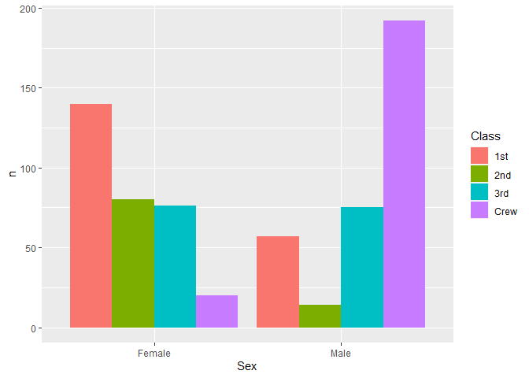
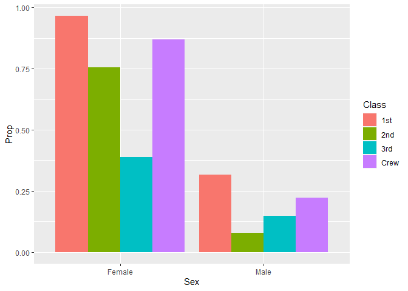
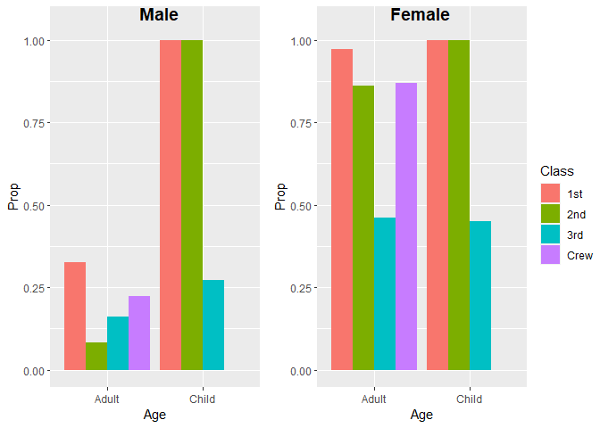

RMS Titanic
================
Mason del Rosario
2020-07-14

  - [First Look](#first-look)
  - [Deeper Look](#deeper-look)
  - [Notes](#notes)

*Purpose*: Most datasets have at least a few variables. Part of our task
in analyzing a dataset is to understand trends as they vary across these
different variables. Unless we’re careful and thorough, we can easily
miss these patterns. In this challenge you’ll analyze a dataset with a
small number of categorical variables and try to find differences among
the groups.

*Reading*: (Optional) [Wikipedia
article](https://en.wikipedia.org/wiki/RMS_Titanic) on the RMS Titanic.

``` r
library(tidyverse)
```

    ## -- Attaching packages --------------------------------------- tidyverse 1.3.0 --

    ## v ggplot2 3.3.2     v purrr   0.3.4
    ## v tibble  3.0.1     v dplyr   1.0.0
    ## v tidyr   1.1.0     v stringr 1.4.0
    ## v readr   1.3.1     v forcats 0.5.0

    ## -- Conflicts ------------------------------------------ tidyverse_conflicts() --
    ## x dplyr::filter() masks stats::filter()
    ## x dplyr::lag()    masks stats::lag()

``` r
df_titanic <- as_tibble(Titanic)
```

*Background*: The RMS Titanic sank on its maiden voyage in 1912; about
67% of its passengers died.

# First Look

<!-- -------------------------------------------------- -->

**q1** Perform a glimpse of `df_titanic`. What variables are in this
dataset?

``` r
glimpse(df_titanic)
```

    ## Rows: 32
    ## Columns: 5
    ## $ Class    <chr> "1st", "2nd", "3rd", "Crew", "1st", "2nd", "3rd", "Crew", ...
    ## $ Sex      <chr> "Male", "Male", "Male", "Male", "Female", "Female", "Femal...
    ## $ Age      <chr> "Child", "Child", "Child", "Child", "Child", "Child", "Chi...
    ## $ Survived <chr> "No", "No", "No", "No", "No", "No", "No", "No", "No", "No"...
    ## $ n        <dbl> 0, 0, 35, 0, 0, 0, 17, 0, 118, 154, 387, 670, 4, 13, 89, 3...

**Observations**:

**Variables**: `Class`, `Sec`, `Age`, `Survived`, `n`

**q2** Skim the [Wikipedia
article](https://en.wikipedia.org/wiki/RMS_Titanic) on the RMS Titanic,
and look for a total count of passengers. Compare against the total
computed below. Are there any differences? Are those differences large
or small? What might account for those differences?

``` r
## NOTE: No need to edit! We'll cover how to
## do this calculation in a later exercise.
df_titanic %>% summarize(total = sum(n))
```

    ## # A tibble: 1 x 1
    ##   total
    ##   <dbl>
    ## 1  2201

**Observations**:

  - The number of entries in the table is 2201, while the above
    Wikipedia article claims 2435 passengers were on the Titanic. Why
    might this be the case?
      - It appears that some passengers embarked and disembarked from
        the Titanic before crossing the Atlantic. For example, some
        passengers only bought a fare from Southampton to Cherbourg to
        cross the English channel.


**q3** Create a plot showing the count of passengers who *did* survive,
along with aesthetics for `Class` and `Sex`. Document your observations
below.

*Note*: There are many ways to do this.

``` r
## TASK: Visualize counts against `Class` and `Sex`
df_titanic %>% 
  filter(Survived == "Yes") %>%
  ggplot(aes(x = Sex, y = n, fill = Class)) +
  geom_bar(stat = "identity", position = position_dodge())
```

<!-- -->

In absolute numbers, how many males vs. females died?

``` r
df_titanic %>% filter(Survived == "Yes") %>%
               group_by(Sex) %>%
               mutate(total_surv = sum(n))
```

    ## # A tibble: 16 x 6
    ## # Groups:   Sex [2]
    ##    Class Sex    Age   Survived     n total_surv
    ##    <chr> <chr>  <chr> <chr>    <dbl>      <dbl>
    ##  1 1st   Male   Child Yes          5        367
    ##  2 2nd   Male   Child Yes         11        367
    ##  3 3rd   Male   Child Yes         13        367
    ##  4 Crew  Male   Child Yes          0        367
    ##  5 1st   Female Child Yes          1        344
    ##  6 2nd   Female Child Yes         13        344
    ##  7 3rd   Female Child Yes         14        344
    ##  8 Crew  Female Child Yes          0        344
    ##  9 1st   Male   Adult Yes         57        367
    ## 10 2nd   Male   Adult Yes         14        367
    ## 11 3rd   Male   Adult Yes         75        367
    ## 12 Crew  Male   Adult Yes        192        367
    ## 13 1st   Female Adult Yes        140        344
    ## 14 2nd   Female Adult Yes         80        344
    ## 15 3rd   Female Adult Yes         76        344
    ## 16 Crew  Female Adult Yes         20        344

So 367 males and 344 females survived.

**Observations**:

  - When comparing sexes, the absolute number of survivors is close…
  - …But the sex-wise class distribution of survivors is skewed.
      - Most adult `Male`s who survived were **Crew**
      - Most adult `Female`s who survived were **1st Class**

# Deeper Look

<!-- -------------------------------------------------- -->

Raw counts give us a sense of totals, but they are not as useful for
understanding differences between groups. This is because the
differences we see in counts could be due to either the relative size of
the group OR differences in outcomes for those groups. To make
comparisons between groups, we should also consider *proportions*.\[1\]

The following code computes proportions within each `Class, Sex, Age`
group.

``` r
## NOTE: No need to edit! We'll cover how to
## do this calculation in a later exercise.
df_prop <-
  df_titanic %>%
  group_by(Class, Sex, Age) %>%
  mutate(
    Total = sum(n),
    Prop = n / Total
  ) %>%
  ungroup()
df_prop
```

    ## # A tibble: 32 x 7
    ##    Class Sex    Age   Survived     n Total    Prop
    ##    <chr> <chr>  <chr> <chr>    <dbl> <dbl>   <dbl>
    ##  1 1st   Male   Child No           0     5   0    
    ##  2 2nd   Male   Child No           0    11   0    
    ##  3 3rd   Male   Child No          35    48   0.729
    ##  4 Crew  Male   Child No           0     0 NaN    
    ##  5 1st   Female Child No           0     1   0    
    ##  6 2nd   Female Child No           0    13   0    
    ##  7 3rd   Female Child No          17    31   0.548
    ##  8 Crew  Female Child No           0     0 NaN    
    ##  9 1st   Male   Adult No         118   175   0.674
    ## 10 2nd   Male   Adult No         154   168   0.917
    ## # ... with 22 more rows

**q4** Replicate your visual from q3, but display `Prop` in place of
`n`. Document your observations, and note any new/different observations
you make in comparison with q3.

Need to separate the `df` based on sex and class,

``` r
df_prop4 <-
  df_titanic %>%
  group_by(Class, Sex) %>%
  mutate(
    Total = sum(n),
    Prop = n / Total
  ) %>%
  ungroup()
df_prop4
```

    ## # A tibble: 32 x 7
    ##    Class Sex    Age   Survived     n Total   Prop
    ##    <chr> <chr>  <chr> <chr>    <dbl> <dbl>  <dbl>
    ##  1 1st   Male   Child No           0   180 0     
    ##  2 2nd   Male   Child No           0   179 0     
    ##  3 3rd   Male   Child No          35   510 0.0686
    ##  4 Crew  Male   Child No           0   862 0     
    ##  5 1st   Female Child No           0   145 0     
    ##  6 2nd   Female Child No           0   106 0     
    ##  7 3rd   Female Child No          17   196 0.0867
    ##  8 Crew  Female Child No           0    23 0     
    ##  9 1st   Male   Adult No         118   180 0.656 
    ## 10 2nd   Male   Adult No         154   179 0.860 
    ## # ... with 22 more rows

``` r
## TASK: Visualize counts against `Class` and `Sex`
df_prop4 %>% 
  filter(Survived == "Yes") %>%
  ggplot(aes(x = Sex, y = Prop, fill = Class)) +
  geom_bar(stat = "identity", position = position_dodge())
```

<!-- -->

**Observations**:

  - Much more telling – most adult `Male`s died across all classes.
  - In contrast, most `Female` passengers of each class survived.
      - The exception, a little under half of 3rd Class `Female`
        passengers survived.

**q5** Create a plot showing the group-proportion of passengers who
*did* survive, along with aesthetics for `Class`, `Sex`, *and* `Age`.
Document your observations below.

*Hint*: Don’t forget that you can use `facet_grid` to help consider
additional variables\!

``` r
library(ggpubr)
par(mfrow=c(1,2))
m_gg <- df_prop %>% 
  filter(Sex == "Male", Survived == "Yes") %>%
  ggplot(aes(x = Age, y = Prop, fill = Class)) +
  geom_bar(stat = "identity", position = position_dodge()) +
  scale_y_continuous(breaks=c(0.0, 0.25, 0.5, 0.75, 1.0)) +
  ylim(0, 1.05)
```

    ## Scale for 'y' is already present. Adding another scale for 'y', which will
    ## replace the existing scale.

``` r
f_gg <- df_prop %>% 
  filter(Sex == "Female", Survived == "Yes") %>%
  ggplot(aes(x = Age, y = Prop, fill = Class)) +
  geom_bar(stat = "identity", position = position_dodge()) +
  scale_y_continuous(breaks=c(0.0, 0.25, 0.5, 0.75, 1.0)) +
  ylim(0, 1.05)
```

    ## Scale for 'y' is already present. Adding another scale for 'y', which will
    ## replace the existing scale.

``` r
figure <- ggarrange(
                    m_gg, f_gg,
                    labels = c("Male", "Female"),
                    ncol = 2, nrow = 1,
                    common.legend = TRUE,
                    legend = "right",
                    label.x = c(0.45, 0.35)
                    )
```

    ## Warning: Removed 1 rows containing missing values (geom_bar).
    
    ## Warning: Removed 1 rows containing missing values (geom_bar).
    
    ## Warning: Removed 1 rows containing missing values (geom_bar).

``` r
figure
```

<!-- -->

What was the average survival rate for adult males?

``` r
df_male <-
  df_titanic %>%
  filter(Age == "Adult", Sex == "Male") %>%
  mutate(Total = sum(n),Prop = n / Total) %>% 
  filter(Survived == "Yes") %>%
  summarize(avg_surv = sum(Prop))
df_male
```

    ## # A tibble: 1 x 1
    ##   avg_surv
    ##      <dbl>
    ## 1    0.203

For adult females?

``` r
df_female <-
  df_titanic %>%
  filter(Age == "Adult", Sex == "Female") %>%
  mutate(Total = sum(n),Prop = n / Total) %>% 
  filter(Survived == "Yes") %>%
  summarize(avg_surv = sum(Prop))
df_female
```

    ## # A tibble: 1 x 1
    ##   avg_surv
    ##      <dbl>
    ## 1    0.744

For children?

``` r
df_child <-
  df_titanic %>%
  filter(Age == "Child") %>%
  mutate(Total = sum(n), Prop = n / Total) %>% 
  filter(Survived == "Yes") %>%
  summarize(avg_surv = sum(Prop))
df_child
```

    ## # A tibble: 1 x 1
    ##   avg_surv
    ##      <dbl>
    ## 1    0.523

**Observations**:

  - The data indicate that the crew prioritized the safety of women (74%
    survived) and children (52% survived). This was an [unwritten
    maritime
    rule](https://en.wikipedia.org/wiki/Women_and_children_first#20th_century),
    and adult men disproportionately perished as a result (20%
    survived).
      - Purportedly, some crew emptied boats *with empty seats* into the
        water when they ran out of women and children to fill them, even
        if there were adult men who could occupy them\!
  - Back to the figure, 1st class passengers survived at a higher rate
    than lower class passengers. This effect of `Class` is most
    noticeable when looking at the adult female and the children
    sections of the plot – while no children in 1st or 2nd class died,
    fewer than half of 3rd class children survived.

# Notes

<!-- -------------------------------------------------- -->

\[1\] This is basically the same idea as [Dimensional
Analysis](https://en.wikipedia.org/wiki/Dimensional_analysis); computing
proportions is akin to non-dimensionalizing a quantity.
