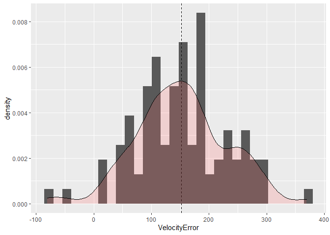
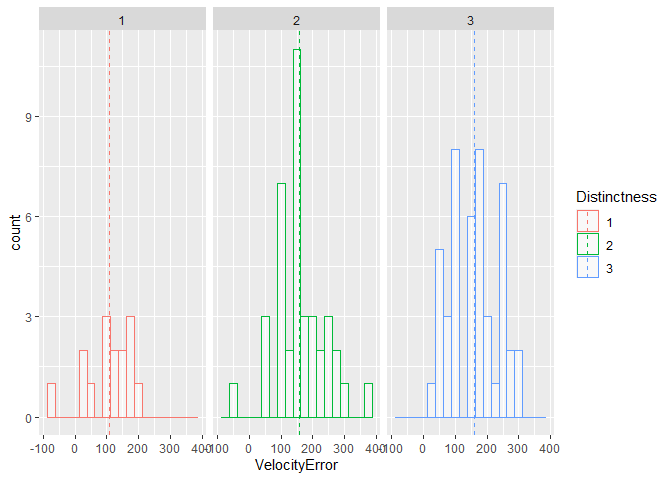
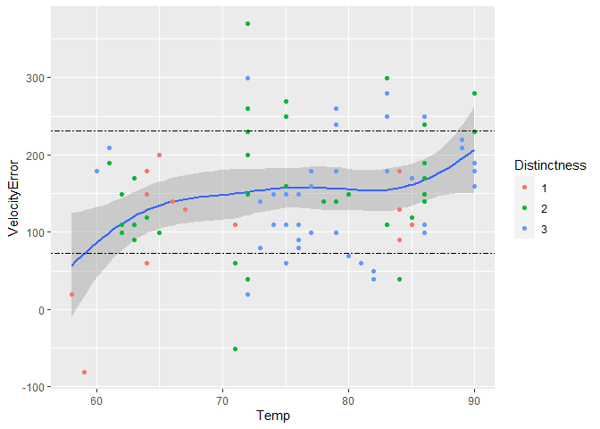
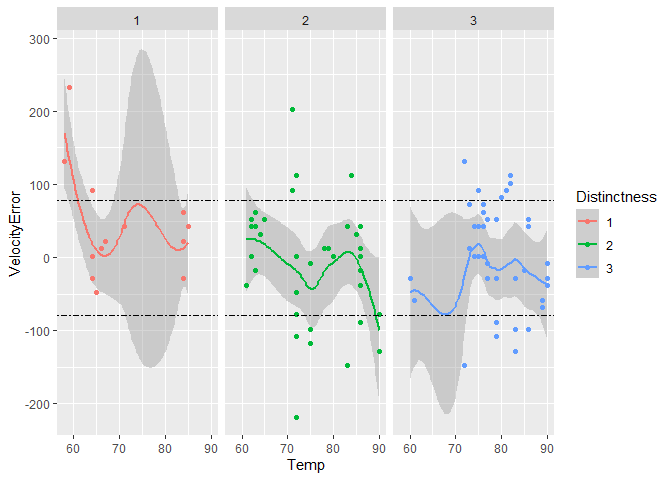

Michelson Speed-of-light Measurements
================
Mason del Rosario
2020-07-18

  - [Error](#error)
  - [Distinctness](#distinctness)
  - [Temperature-dependence](#temperature-dependence)
  - [Closing Thoughts](#closing-thoughts)
  - [Bibliography](#bibliography)

``` r
# Libraries
library(tidyverse)
library(googlesheets4)

url <- "https://docs.google.com/spreadsheets/d/1av_SXn4j0-4Rk0mQFik3LLr-uf0YdA06i3ugE6n-Zdo/edit?usp=sharing"

# Parameters
LIGHTSPEED_VACUUM    <- 299792.458 # Exact speed of light in a vacuum (km / s)
LIGHTSPEED_MICHELSON <- 299944.00  # Michelson's speed estimate (km / s)
LIGHTSPEED_PM        <- 51         # Michelson error estimate (km / s)
```

*Background*: In 1879 Albert Michelson led an experimental campaign to
measure the speed of light. His approach was a development upon the
method of Foucault, and resulted in a new estimate of
\(v_0 = 299944 \pm 51\) kilometers per second (in a vacuum). This is
very close to the modern *exact* value of `r LIGHTSPEED_VACUUM`. In this
challenge, you will analyze Michelson’s original data, and explore some
of the factors associated with his experiment.

I’ve already copied Michelson’s data from his 1880 publication; the code
chunk below will load these data from a public googlesheet.

*Aside*: The speed of light is *exact* (there is **zero error** in the
value `LIGHTSPEED_VACUUM`) because the meter is actually
[*defined*](https://en.wikipedia.org/wiki/Metre#Speed_of_light_definition)
in terms of the speed of light\!

``` r
## Note: No need to edit this chunk!
gs4_deauth()
ss <- gs4_get(url)
df_michelson <-
  read_sheet(ss) %>%
  select(Date, Distinctness, Temp, Velocity) %>%
  mutate(Distinctness = as_factor(Distinctness))
```

    ## Reading from "michelson1879"

    ## Range "Sheet1"

``` r
df_michelson %>% glimpse
```

    ## Rows: 100
    ## Columns: 4
    ## $ Date         <dttm> 1879-06-05, 1879-06-07, 1879-06-07, 1879-06-07, 1879-...
    ## $ Distinctness <fct> 3, 2, 2, 2, 2, 2, 3, 3, 3, 3, 2, 2, 2, 2, 2, 1, 3, 3, ...
    ## $ Temp         <dbl> 76, 72, 72, 72, 72, 72, 83, 83, 83, 83, 83, 90, 90, 71...
    ## $ Velocity     <dbl> 299850, 299740, 299900, 300070, 299930, 299850, 299950...

*Data dictionary*:

  - `Date`: Date of measurement
  - `Distinctness`: Distinctness of measured images: 3 = good, 2 = fair,
    1 = poor
  - `Temp`: Ambient temperature (Fahrenheit)
  - `Velocity`: Measured speed of light (km / s)

**q1** Re-create the following table (from Michelson (1880), pg. 139)
using `df_michelson` and `dplyr`. Note that your values *will not* match
those of Michelson *exactly*; why might this be?

| Distinctness | n  | MeanVelocity |
| ------------ | -- | ------------ |
| 3            | 46 | 299860       |
| 2            | 39 | 299860       |
| 1            | 15 | 299810       |

``` r
## TODO: Compute summaries
df_q1 <- NA
df_michelson %>%
  group_by(Distinctness) %>%
  summarise(n = n(), MeanVelocity = mean(Velocity))
```

    ## `summarise()` ungrouping output (override with `.groups` argument)

    ## # A tibble: 3 x 3
    ##   Distinctness     n MeanVelocity
    ##   <fct>        <int>        <dbl>
    ## 1 1               15      299808 
    ## 2 2               39      299858.
    ## 3 3               46      299862.

**Observations**:

  - The number of observations per `Distinctness` matches.
  - **Why might your table differ from Michelson’s?**
      - **Rounding** I have not specified any numerical precision, and
        the output of `mean()` appears to be taken to 7 significant
        figures. In contrast, Michelson’s table seems to be truncated to
        5 significant figures.

The `Velocity` values in the dataset are the speed of light *in air*;
Michelson introduced a couple of adjustments to estimate the speed of
light in a vacuum. In total, he added \(+92\) km/s to his mean estimate
for `VelocityVacuum` (from Michelson (1880), pg. 141). While this isn’t
fully rigorous (\(+92\) km/s is based on the mean temperature), we’ll
simply apply this correction to all the observations in the dataset.

**q2** Create a new variable `VelocityVacuum` with the \(+92\) km/s
adjustment to `Velocity`. Assign this new dataframe to `df_q2`.

``` r
## TODO: Adjust the data, assign to df_q2
df_q2 <- df_michelson %>%
  mutate(VelocityVacuum = Velocity + 92)
df_q2
```

    ## # A tibble: 100 x 5
    ##    Date                Distinctness  Temp Velocity VelocityVacuum
    ##    <dttm>              <fct>        <dbl>    <dbl>          <dbl>
    ##  1 1879-06-05 00:00:00 3               76   299850         299942
    ##  2 1879-06-07 00:00:00 2               72   299740         299832
    ##  3 1879-06-07 00:00:00 2               72   299900         299992
    ##  4 1879-06-07 00:00:00 2               72   300070         300162
    ##  5 1879-06-07 00:00:00 2               72   299930         300022
    ##  6 1879-06-07 00:00:00 2               72   299850         299942
    ##  7 1879-06-09 00:00:00 3               83   299950         300042
    ##  8 1879-06-09 00:00:00 3               83   299980         300072
    ##  9 1879-06-09 00:00:00 3               83   299980         300072
    ## 10 1879-06-09 00:00:00 3               83   299880         299972
    ## # ... with 90 more rows

As part of his study, Michelson assessed the various potential sources
of error, and provided his best-guess for the error in his
speed-of-light estimate. These values are provided in
`LIGHTSPEED_MICHELSON`—his nominal estimate—and
`LIGHTSPEED_PM`—plus/minus bounds on his estimate. Put differently,
Michelson believed the true value of the speed-of-light probably lay
between `LIGHTSPEED_MICHELSON - LIGHTSPEED_PM` and `LIGHTSPEED_MICHELSON
+ LIGHTSPEED_PM`.

Let’s introduce some terminology:\[2\]

  - **Error** is the difference between a true value and an estimate of
    that value; for instance `LIGHTSPEED_VACUUM - LIGHTSPEED_MICHELSON`.
  - **Uncertainty** is an analyst’s *assessment* of the error.

Since a “true” value is often not known in practice, one generally does
not know the error. The best they can do is quantify their degree of
uncertainty. We will learn some means of quantifying uncertainty in this
class, but for many real problems uncertainty includes some amount of
human judgment.\[2\]

**q3** Compare Michelson’s speed of light estimate against the modern
speed of light value. Is Michelson’s estimate of the error (his
uncertainty) greater or less than the true error?

``` r
## TODO: Compare Michelson's estimate and error against the true value
## Your code here!
LIGHTSPEED_ERROR = LIGHTSPEED_VACUUM - LIGHTSPEED_MICHELSON
ERROR_RATIO = abs(LIGHTSPEED_ERROR / LIGHTSPEED_PM) 
ERROR_RATIO
```

    ## [1] 2.971412

So the error in `LIGHT_MICHELSON` was nearly 3 times as large as
Michelson’s original error assessment\!

**Observations**:

  - We might conclude that Michelson was overconfident in his estimate
    of the error.
  - Were he “appropriately confident”\*\* (i.e., had his uncertainty
    range been larger), then the true velocity would have fallen withing
    his range of estimates.
      - \*\*\[2\] provides a means of calibrating one’s uncertainty
        estimate (the Birge ratio), but it it supposes that you have
        access to the ground-truth.

**q4** You have access to a few other variables. Construct a few
visualizations of `VelocityVacuum` against these other factors. Are
there other patterns in the data that might help explain the difference
between Michelson’s estimate and `LIGHTSPEED_VACUUM`?

## Error

First, let’s get a `df` with the error of each observation. We take the
error as the difference between a single observation and the *true*
velocity.

``` r
df_err <- df_q2 %>% 
  mutate(VelocityError = VelocityVacuum - LIGHTSPEED_VACUUM)
```

Let’s look at the distribution of error.

``` r
df_err %>% 
  ggplot(aes(x = VelocityError)) +
  geom_histogram(aes(y = ..density.., binwidth = 25)) +
  geom_vline(aes(xintercept = mean(VelocityError)),
             linetype = "dashed") +
  geom_density(alpha = 0.2, fill="#FF6666")
```

    ## Warning: Ignoring unknown aesthetics: binwidth

    ## `stat_bin()` using `bins = 30`. Pick better value with `binwidth`.

<!-- -->

``` r
df_err %>% summarize(err_mean = mean(VelocityError))
```

    ## # A tibble: 1 x 1
    ##   err_mean
    ##      <dbl>
    ## 1     152.

*Note*: `geom_density` applies a kernel density estimate with a Gaussian
(normal) kernel.

The mean of the error distribution is biased (we already knew that from
earlier).

## Distinctness

Michelson also also reported on the `Distinctness` of each observation.
Presumably, increasingly ‘distinct’ measurements should be increasingly
precise (low variance) or increasingly accurate (low bias). Let’s see if
either of these is true.

``` r
library(plyr)
```

    ## ------------------------------------------------------------------------------

    ## You have loaded plyr after dplyr - this is likely to cause problems.
    ## If you need functions from both plyr and dplyr, please load plyr first, then dplyr:
    ## library(plyr); library(dplyr)

    ## ------------------------------------------------------------------------------

    ## 
    ## Attaching package: 'plyr'

    ## The following objects are masked from 'package:dplyr':
    ## 
    ##     arrange, count, desc, failwith, id, mutate, rename, summarise,
    ##     summarize

    ## The following object is masked from 'package:purrr':
    ## 
    ##     compact

``` r
mu <- df_err %>%
  ddply(
        "Distinctness", summarise,
        grp.mean = mean(VelocityError),
        grp.sd = sd(VelocityError),
        grp.abs_mean = mean(abs(VelocityError)),
        grp.abs_sd = sd(abs(VelocityError))
        )
mu
```

    ##   Distinctness grp.mean   grp.sd grp.abs_mean grp.abs_sd
    ## 1            1 107.5420 76.17649     118.2697   56.63371
    ## 2            2 158.0035 79.32407     160.5911   73.79852
    ## 3            3 161.2811 76.39966     161.2811   76.39966

So far, my hypothesis isn’t holding up. Whether we look at the raw or
absolute error, both the *mean* and the *standard deviation* increase
monotonically with increasing `Distinctness`. We can visualize this with
some histograms.

``` r
df_err %>% 
  ggplot(aes(x = VelocityError, color = Distinctness)) +
  geom_histogram(fill = "white", alpha = 0.5, position="dodge", binwidth = 25) +
  facet_wrap(~ Distinctness)+
  geom_vline(data = mu, aes(xintercept = grp.mean, color = Distinctness), linetype = "dashed")
```

<!-- -->

## Temperature-dependence

We also have access to the temperature per observation. Let’s visualize
the error as a function of temperature.

``` r
df_err %>% 
  ggplot(aes(x = Temp, y = VelocityError)) +
  geom_smooth() +
  geom_point(aes(color = Distinctness)) +
  geom_hline(aes(yintercept = mean(VelocityError) + sd(VelocityError)), linetype = "twodash") +
  geom_hline(aes(yintercept = mean(VelocityError) - sd(VelocityError)), linetype = "twodash")
```

    ## `geom_smooth()` using method = 'loess' and formula 'y ~ x'

<!-- -->

**Observations**

  - There may be a slight positive correlation between `Temp` and
    `VelocityError`, but there isn’t strong evidence for such a
    correlation.
  - The “more distinct” experiments (`Distinctness` of 2 and 3) mostly
    took place at `Temp` greater than 70 while the “least distinct”
    experiments (`Distinctness` of 1) took place below 70.

<!-- end list -->

``` r
df_q2 %>% 
  mutate(VelocityError = LIGHTSPEED_MICHELSON - VelocityVacuum) %>%
  ggplot(aes(x = Temp, y = VelocityError)) +
  facet_wrap(~ Distinctness) +
  geom_smooth(aes(color = Distinctness)) +
  geom_point(aes(color = Distinctness)) +
  geom_hline(aes(yintercept = mean(VelocityError) + sd(VelocityError)), linetype = "twodash") +
  geom_hline(aes(yintercept = mean(VelocityError) - sd(VelocityError)), linetype = "twodash")
```

    ## `geom_smooth()` using method = 'loess' and formula 'y ~ x'

<!-- -->

Across the range of temperatures, there appears to be less variation in
observations of `Distinctness` 2, but we take that with a grain of salt
since `geom_smooth`.

## Closing Thoughts

  - Based on the `err_all` chunk, there is clearly some source of
    systemic error in Michelson’s experiments. Whether this was from his
    modeling assumptions or his experimental setup is difficult to
    conclude based on
  - Based on the `err_tab` and `err_distinct` chunks, we find that
    Michelson’s notion of `Distinctness` doesn’t really account for a
    reduction in variance or bias (both of which I interpret to be
    sources of uncertainty).
  - Based on the `temp` chunk, we might conclude that there is a slight
    positive correlation between error and temperature.
  - Overall, we could use more information or do more research to unpack
    what the sources of uncertainty were in Michelson’s experiment…
      - …and Michelson could have been more conservative with his
        uncertainty estimates.

## Bibliography

  - \[1\] Michelson, [Experimental Determination of the Velocity of
    Light](https://play.google.com/books/reader?id=343nAAAAMAAJ&hl=en&pg=GBS.PA115)
    (1880)
  - \[2\] Henrion and Fischhoff, [Assessing Uncertainty in Physical
    Constants](https://www.cmu.edu/epp/people/faculty/research/Fischoff-Henrion-Assessing%20uncertainty%20in%20physical%20constants.pdf)
    (1986)
